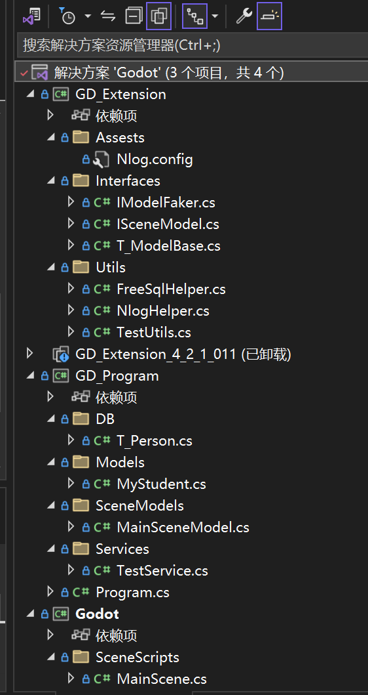

# GodotNet_Csharp_SimpleDemo
使用CSharp工程化开发Godot 游戏

# 对应CSDN博客地址

> [Godot.NET C# 工程化开发(1):通用Nuget 导入+ 模板文件导出，包含随机数生成，日志管理，数据库连接等功能](https://blog.csdn.net/qq_44695769/article/details/136984753?csdn_share_tail=%7B%22type%22%3A%22blog%22%2C%22rType%22%3A%22article%22%2C%22rId%22%3A%22136984753%22%2C%22source%22%3A%22qq_44695769%22%7D)


# Visual Studio项目

## 运行环境
- window 10
- .net core 8.0
- godot 4.2.1
- visual studio 2022

## Nuget使用


## 项目逻辑

- GD_Extesion:Godot工具类，后面用于导出
	- Assests:资源文件夹
	- Utils:工具类
	- Interfaces：接口类
- GD_Program:Godot运行逻辑
	- SceneModels:场景脚本实际运行类，IOC装配生成
	- Services:服务类
	- Program.cs:IOC容器位置
- Godot：Godot引擎生成解决方案
	- Scene:挂载脚本，只用于建立脚本连接关系 

## 项目整体


## 项目模板导入

GD_Extension_4_2_1_01.zip就是我导出的项目模板了，直接导入到即可
```
C:\Users\xxx(你的用户名)\Documents\Visual Studio 2022\Templates\ProjectTemplates
```

GodotProgram_4_2_1_1.zip这个文件，我感觉这个设计的更加好了。因为我之前想设置三层项目，现在想想两层应该也够用了。
